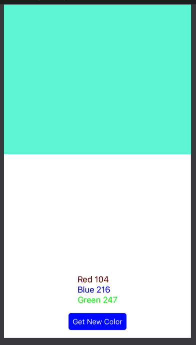
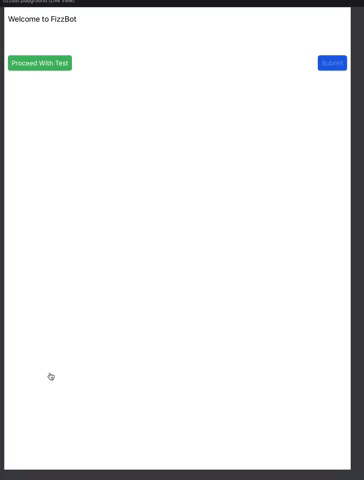

# Github Noops Challenge
https://noopschallenge.com/

Repo of the Github noop challenges. For all challenges, I used Xcode Playgrounds

- [X] Hexbot
- [X] Fizzbot
- [ ] Drumbot
- [ ] Vexbot
- [ ] Directbot

- [ ] Mazebot
- [ ] Polybot
- [ ] Golfbot
- [ ] Cambot
- [ ] Automatabot

## Hexbot
Display color and show the RGB components

## Fizzbot
Display the FizzBuzz questions in the LiveView
note: In Xcode 10.2.1, LiveView has a bug where it doesn't scale with the keyboard. So you have to set the view width and height to about 700x1000

